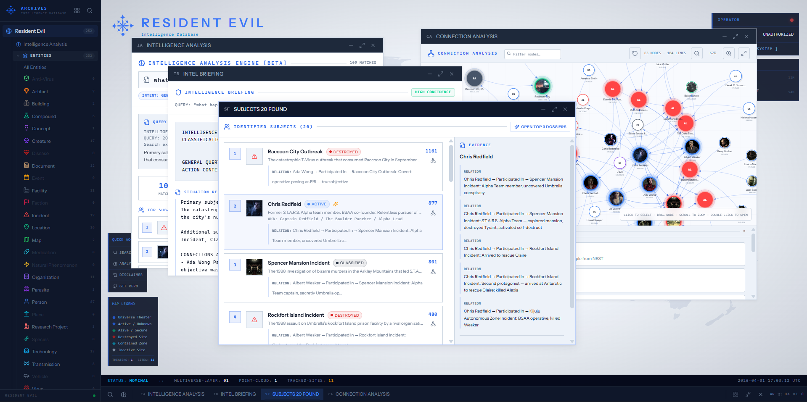
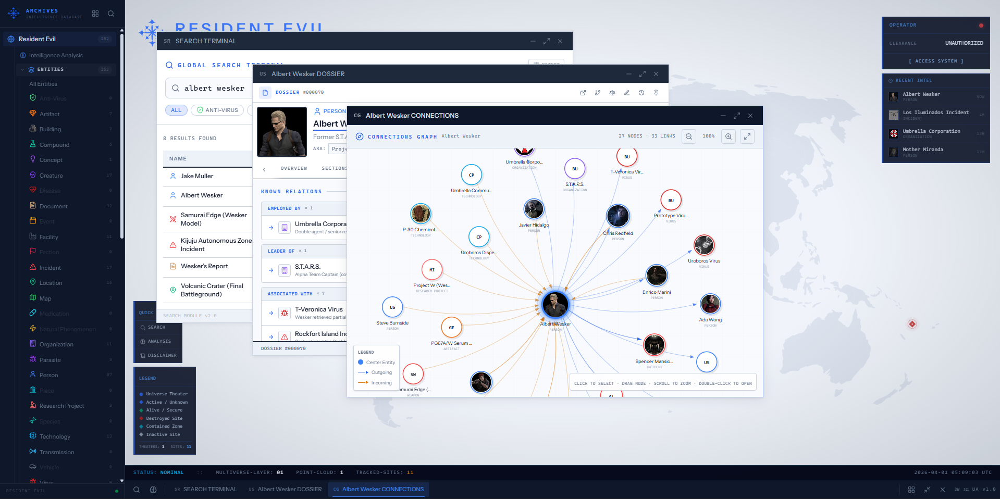
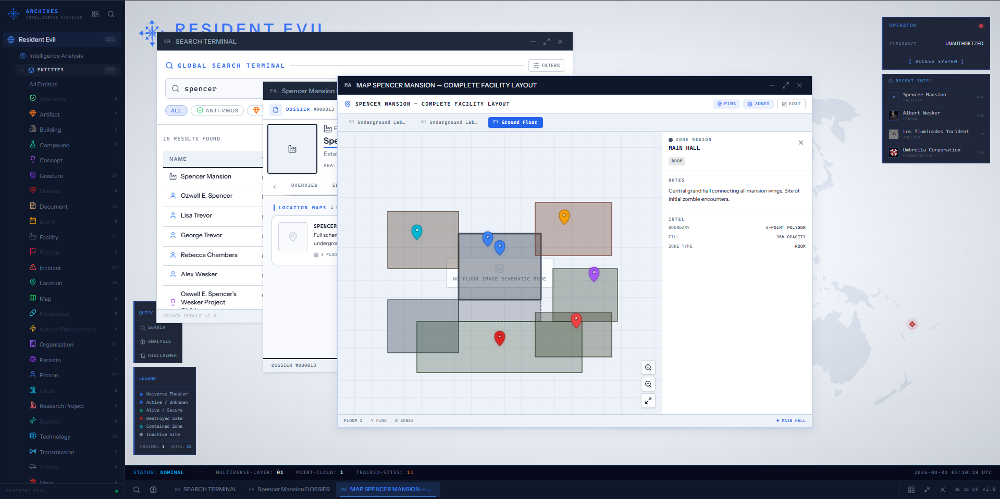

# Archives

> An intelligence database workbench for fictional universes.  
> Clone it. Seed it. Feel like you're inside the lore.



Archives is a structured lore platform with a classified-database aesthetic, not a freeform wiki.
Every entity has a type, typed relationships, and a rich set of structured records:
infection histories, mutation stages, intelligence assessments, timeline positions, and more.
The frontend is a Multiple Document Interface workbench where dossiers, relationship graphs,
maps, and search results open as draggable windows inside a single workspace styled after
an in-universe government intelligence terminal.

**[Live demo](https://archives.fenasal.com)**

---

## Table of contents

- [What it does](#what-it-does)
- [Data model](#data-model)
- [The workbench interface](#the-workbench-interface)
- [Advanced search](#advanced-search)
- [Tech stack](#tech-stack)
- [Requirements](#requirements)
- [Local development](#local-development)
- [Docker](#docker)
- [API reference](#api-reference)
- [Roles and permissions](#roles-and-permissions)
- [Locking](#locking)
- [Caching](#caching)
- [Revision history](#revision-history)
- [Project structure](#project-structure)
- [Road Map](#roadmap)
- [Screenshots](#screenshots)
- [License](#license)

---

## What it does

Archives is a structured lore database. It is not a freeform wiki and not a CMS. The goal is to
give a fictional universe, any universe, the same depth of organized, cross-referenced data
that a real intelligence archive would have.

You define entity types. You add entities. Each entity can carry free-text sections, a dynamic
attribute set, typed relations to other entities, and a collection of structured records covering
everything from pathogen exposure to recorded dialogue. Timelines order events. Media sources
track appearances. Interactive maps place entities in physical space.

The whole thing is readable by anyone (public API, SEO-friendly wiki pages) and writable by
authenticated users with the right permissions.

---

## Data model

The central concept is the **entity**. An entity is anything with an identity in the universe:
a person, a location, an organization, a pathogen, a creature, a weapon, a facility, a research
project, a historical incident, or a recorded transmission. Entity types are not hardcoded, they
are rows in the `meta_entity_types` table and can be created, renamed, or deleted through the
admin panel.

Every entity can have:

**Core fields**
- Name, slug, short description, long-form content (rich text), featured flag
- Type and status (both from configurable lookup tables)
- Tags (global, polymorphic) and categories (universe-scoped, hierarchical)
- Aliases, alternative names and codenames, each with a type label
- Sections, ordered, titled content blocks with a section type (biography, notes, abilities, etc.)
- Attributes, typed key-value data grouped by definition (e.g. Height, Blood Type, Clearance Level)
- Images, polymorphic, sortable, with alt text, caption, and credit fields

**Relations**

Typed, directional links between entities. Each relation has a `relation_type` from the configurable
lookup table, optional temporal metadata (start/end dates in both real and fictional calendars), and
a notes field. The relation graph is available as a lightweight JSON payload for graph rendering.

**Structured records** (10 types, all CRUD via a single unified controller)

| Record type | What it captures |
|---|---|
| Infection records | Pathogen exposure: the infecting pathogen, cure, symptoms, side effects, stage, reversibility |
| Mutation stages | Transformation progression: stage number, trigger entity, physical changes, abilities gained |
| Affiliation history | Organization membership over time: role, rank, start/end dates, circumstances |
| Death records | Death and revival: cause, death type, killer, incident, location, revival method, body modifications |
| Consciousness records | Consciousness transfer or vessel possession: origin, target vessel, transfer method, current state |
| Intelligence records | Analyst observations: observer, subject, classification level, reliability rating, redaction flag |
| Power profiles | Ability assessments: power name, level, source entity, description |
| Quotes | Recorded statements: content, source media, fictional date, context |
| Transmission participants | Entities involved in a transmission (radio/document/dialogue): role (speaker, listener, interceptor, mentioned, etc.) |
| Transmission records | Individual lines within a transmission: content type (dialogue, narration, action, static, redacted), speaker, sort order |

**Timelines and events**

A timeline is an ordered sequence of events scoped to a universe. Events have real and fictional
dates, a location, participants, and a type. Entities are attached to timelines via a pivot table.

**Media sources**

Track which games, films, books, or other works an entity appears in. Media sources belong to a
universe and entities are attached via a pivot.

**Interactive maps**

A map is itself typed as an entity (type: `map`). It has one or more floors, each with an uploaded
image. Markers and regions are placed on floors using percentage-based coordinates so they stay
aligned regardless of display size. Markers link back to entities.

---

## The workbench interface

The frontend is a Multiple Document Interface (MDI) workbench. There is a persistent left sidebar
for navigation and a central workspace area where content opens as internal windows.

Windows are individually draggable, resizable, minimizable, and maximizable. You can have multiple
entity dossiers open at once alongside a search terminal, a timeline view, and a map, all within
the same browser tab. Clicking an entity link inside a dossier opens that entity in a new window
rather than navigating away.

The visual design is modeled after a classified government intelligence terminal: monospace type
(JetBrains Mono), sharp corners throughout, a navy/ice-blue/white palette, dot-grid backgrounds,
and unfocused windows rendered at reduced opacity. Status badges are color-coded (alive, deceased,
active, dormant, classified).

There is also a public-facing wiki layer under `/w/` that renders SEO-friendly, server-rendered
pages for every entity and universe, no login required.

---

## Advanced search

Beyond standard keyword search (which searches names, descriptions, aliases, and section text),
Archives includes a natural-language advanced search engine.

**How it works:**

1. The `SearchQueryParser` tokenizes the raw query, strips stop words, and detects intent signals.
   It loads all entity names from the current universe at query time and treats multi-word names
   (e.g. "Albert Wesker", "Mother Miranda") as protected phrases that are not split during
   tokenization. Universe-specific compound names can also be stored in `universes.compound_names`
   for the same treatment.

2. Action words in the query are mapped to relation types and record types. Searching for
   "who infected" resolves to infection records. "who killed" resolves to death records with a
   specific killer. "allies of" resolves to affiliation or relation type slugs. There are 50+
   mapped action verbs, supplemented at runtime by any relation type slugs in the database.

3. The `AdvancedSearchService` runs a multi-signal scoring pass across names (100 pts), aliases
   (85 pts), descriptions, section text, quotes, attributes, cross-references, power profiles,
   relations (50 pts), and structured records (35-40 pts). Each matching signal produces a
   context excerpt.

4. The result includes ranked entities with excerpts, a connection subgraph for the matched
   entities, and a generated intelligence briefing.

The advanced search endpoint is `GET /api/universes/{universe}/advanced-search?q=...`. The
frontend exposes it through the workbench's Brain icon in the taskbar, which opens a dedicated
Intelligence Analysis panel with three tabs: briefing, subjects, and a mini force-directed graph.

---

## Tech stack

**Backend**
- PHP 8.3+ / Laravel 13
- Inertia.js (server-side rendering bridge for the SPA)
- Laravel Sanctum (API token and session authentication)
- Laravel Fortify (login, registration, two-factor auth)
- Laravel Telescope (request/query inspection, development only)
- Laravel Wayfinder (generates typed TypeScript route helpers from PHP routes)
- Pest 4 (testing)
- SQLite (development default) / MySQL 8 (production)

**Frontend**
- React 19 with the Babel Compiler plugin (automatic memoization)
- TypeScript in strict mode
- Tailwind CSS 4 via the official Vite plugin
- Vite 5 for bundling
- Zustand for window and application state management
- Inertia.js React adapter for page hydration
- Radix UI for accessible headless component primitives
- React Hook Form with Zod schema resolvers
- Tiptap 3 for rich text editing (entity sections)
- React-Leaflet with `CRS.Simple` for floor-plan map rendering
- Recharts for data visualization
- Sonner for toast notifications

---

## Requirements

- PHP 8.3 or higher
- Composer 2
- Node.js 20+ and npm
- SQLite 3 (development) or MySQL 8+ (production)

---

## Local development

```bash
git clone https://github.com/bywyd/archives.git
cd archives
cp .env.example .env
```

The `.env.example` defaults are configured for SQLite. No database server is needed for local
development. Open `.env` and adjust only if you want to point at a MySQL instance instead.

```bash
composer install
php artisan key:generate
php artisan migrate
```

```bash
npm install --legacy-peer-deps
```

The `--legacy-peer-deps` flag is required because `react-simple-maps` and `react-leaflet` have
conflicting React peer dependency declarations.

```bash
composer run dev
```

This starts three processes concurrently: the PHP development server, the queue worker, and the
Vite dev server. The application is available at `http://localhost:8000`.

**Seeding**

The included seeder populates database with common initials with Attributes, Metadata, Rbac and a super user. 

```bash
php artisan db:seed
```

The seeder also creates a default user: check `database/seeders/DatabaseSeeder.php` for the
email and password. After seeding, assign the user the super-admin role through the admin panel
at `/admin`.

Credentials after seeding:
Email : test@example.com
password : password

---

## Docker

A multi-stage `Dockerfile` builds the application in one stage and copies the result into a
minimal PHP-FPM Alpine image with Nginx and Supervisor. `docker-compose.yml` adds MySQL 8 with
a health check.

```bash
cp .env.example .env
```

Set the following values in `.env` before starting:

```
APP_KEY=           # generate with: php artisan key:generate --show
DB_DATABASE=archives
DB_USERNAME=laravel
DB_PASSWORD=secret
DB_ROOT_PASSWORD=rootsecret
```

```bash
docker compose up -d
docker compose exec app php artisan key:generate --force
docker compose exec app php artisan migrate --force
docker compose exec app php artisan db:seed --force   # optional
```

The application is exposed on port 80 by default, configurable via `APP_PORT` in `.env`. Storage
and database volumes are named and persist across container restarts. A queue worker service is
defined in the compose file but commented out, uncomment it if you need background job processing.

---

## API reference

All `GET` endpoints are public and rate-limited. All `POST`, `PUT`, and `DELETE` endpoints require
a valid session or Sanctum token and the appropriate permission.

### Global

```
GET    /api/search                                                  full-text search across all universes
GET    /api/tags
GET    /api/meta/entity-types
GET    /api/meta/entity-statuses
GET    /api/meta/relation-types
GET    /api/meta/attribute-definitions
```

### Universes

```
GET    /api/universes
GET    /api/universes/{universe}
POST   /api/universes                                               requires universes.create
PUT    /api/universes/{universe}                                    requires universes.update
DELETE /api/universes/{universe}                                    requires universes.delete
PUT    /api/universes/{universe}/lock                               requires universes.lock
```

### Entities

```
GET    /api/universes/{universe}/entities
GET    /api/universes/{universe}/entities/{entity}
GET    /api/universes/{universe}/entities/{entity}/graph            lightweight relation graph payload
GET    /api/universes/{universe}/entities/{entity}/preview          card-level summary
GET    /api/universes/{universe}/entities/{entity}/relations
GET    /api/universes/{universe}/entities/{entity}/revisions
GET    /api/universes/{universe}/entity-locations                   entities with lat/lon attributes
GET    /api/universes/{universe}/sidebar-tree
GET    /api/universes/{universe}/search
GET    /api/universes/{universe}/advanced-search?q=...
POST   /api/universes/{universe}/entities
PUT    /api/universes/{universe}/entities/{entity}
DELETE /api/universes/{universe}/entities/{entity}
PUT    /api/universes/{universe}/entities/{entity}/lock             requires entities.lock
POST   /api/universes/{universe}/entities/{entity}/revisions/{revision}/rollback
POST   /api/universes/{universe}/entities/{entityId}/restore        restores soft-deleted entity
```

### Entity sub-resources (per-entity read endpoints)

```
GET    /api/universes/{universe}/entities/{entity}/infection-records
GET    /api/universes/{universe}/entities/{entity}/mutation-stages
GET    /api/universes/{universe}/entities/{entity}/affiliation-history
GET    /api/universes/{universe}/entities/{entity}/death-records
GET    /api/universes/{universe}/entities/{entity}/consciousness-records
GET    /api/universes/{universe}/entities/{entity}/intelligence-records
GET    /api/universes/{universe}/entities/{entity}/power-profiles
GET    /api/universes/{universe}/entities/{entity}/quotes
GET    /api/universes/{universe}/entities/{entity}/transmission-participants
GET    /api/universes/{universe}/entities/{entity}/transmission-records
GET    /api/universes/{universe}/entities/{entity}/sections
GET    /api/universes/{universe}/entities/{entity}/attributes
GET    /api/universes/{universe}/entities/{entity}/maps
GET    /api/universes/{universe}/entities/{entity}/maps/{map}
```

### Unified record write endpoint

All 10 structured record types share a single controller with a `{recordType}` path parameter:

```
POST   /api/universes/{universe}/entities/{entity}/records/{recordType}
PUT    /api/universes/{universe}/entities/{entity}/records/{recordType}/{recordId}
DELETE /api/universes/{universe}/entities/{entity}/records/{recordType}/{recordId}
```

Valid `recordType` values: `infection-records`, `mutation-stages`, `affiliation-history`,
`death-records`, `consciousness-records`, `intelligence-records`, `power-profiles`, `quotes`,
`transmission-participants`, `transmission-records`.

### Other resources

```
GET/POST/PUT/DELETE  /api/universes/{universe}/timelines
GET/POST/PUT/DELETE  /api/universes/{universe}/timelines/{timeline}/events
GET/POST/PUT/DELETE  /api/universes/{universe}/media-sources
GET/POST/PUT/DELETE  /api/universes/{universe}/categories
GET/POST/PUT/DELETE  /api/universes/{universe}/relations
GET/POST/PUT/DELETE  /api/universes/{universe}/entities/{entity}/sections
GET/POST/PUT/DELETE  /api/universes/{universe}/entities/{entity}/attributes
GET/POST/PUT/DELETE  /api/universes/{universe}/entities/{entity}/maps (floors, markers, regions)
POST/PUT/DELETE      /api/images
GET/POST/PUT/DELETE  /api/meta/* (requires meta.manage)
GET/POST/PUT/DELETE  /api/rbac/roles, /api/rbac/permissions
```

The API is JSON-only. All responses use Laravel API Resources. Paginated endpoints include a
`meta` object with `total`, `current_page`, and `last_page`.

---

## Roles and permissions

Archives uses a custom RBAC system. Roles have many permissions, users have many roles.
The `is_super_admin` flag on a role implicitly grants all permissions and prevents modification
through the API.

Permissions are grouped and checked via the `permission:` middleware on protected routes.
The `entity-mutation` middleware additionally enforces lock state before allowing writes.

Default permission slugs seeded by `RbacSeeder`:

| Group | Slugs |
|---|---|
| Entities | `entities.create`, `entities.update`, `entities.delete`, `entities.lock`, `entities.rollback` |
| Universes | `universes.create`, `universes.update`, `universes.delete`, `universes.lock` |
| Meta | `meta.manage` |
| RBAC | `rbac.manage` |

Roles and permissions are fully manageable at runtime through the admin panel at `/admin/roles`.

---

## Locking

Both universes and entities support a soft lock. When a universe is locked, all write operations
against entities and records within it are blocked unless the requesting user has the `entities.lock`
permission. When an individual entity is locked, the same check applies to that entity specifically.

Locks do not affect read access.

---

## Caching

Frequently read payloads are cached using Laravel's cache layer (database driver by default,
configurable to Redis or Memcached).

| Cache key | TTL | Contents |
|---|---|---|
| `entities:{id}:show` | 30 min | Full entity with 30+ eager-loaded relations |
| `entities:{id}:graph` | 30 min | Lightweight relation graph for graph rendering |
| `universes:{id}:sidebar-tree` | 30 min | Type/timeline/category/media counts for sidebar |
| `universes:{id}:entity-locations` | 30 min | Entities with geographic coordinates |
| `entity_maps:{id}:show` | 30 min | Map with floors, markers, and regions |

Cache invalidation is automatic. Three model traits watch for `saved` and `deleted` events:

- `HasCaching`, used on root models (Entity, Universe, Map). Clears own contexts on change and cascades to parents.
- `BustsEntityCache`, used on all 16 entity sub-record models. On save or delete, clears the parent entity's `show` cache.
- `BustsUniverseCache`, used on Category, MediaSource, Timeline. Clears the parent universe's `sidebar-tree` cache.

When an `EntityRelation` is saved, both the `from_entity` and `to_entity` caches are cleared.

---

## Revision history

The `HasRevisions` trait is applied to Entity and Universe. It automatically records a revision on
every `created`, `updated`, and `deleted` event, storing the old and new values alongside the
authenticated user's ID.

Revisions are viewable per entity at `GET /api/universes/{universe}/entities/{entity}/revisions`
and on the public wiki at `/w/{universe}/{entity}/history`. An authorized user can roll back an
entity to any previous revision via `POST .../revisions/{revision}/rollback`, or restore a
soft-deleted entity via `POST .../entities/{id}/restore`.

---

## Project structure

Folder structure has typical full-stack laravel application, but I'll leave quick details below:

```
app/
  Http/
    Controllers/Api/      EntityController, EntityRecordController, SearchController,
                          MapController, UniverseController, RbacController, and 10 others
    Controllers/          WikiController (public pages), SitemapController, settings
    Middleware/           entity-mutation (lock enforcement), permission (RBAC check)
    Resources/            API resource transformers for every model
    Requests/             Form request validation classes
  Models/                 36 Eloquent models
  Services/               AdvancedSearchService, SearchQueryParser
  Concerns/               HasCaching, BustsEntityCache, BustsUniverseCache,
                          HasImage, HasRevisions, HasRoles

database/
  migrations/             53 migrations
  seeders/

resources/
  js/
    components/
      archives/           Entity dossiers, lists, relations, records, maps, search
      workbench/          MDI window system (InternalWindow, WindowManager, WindowTaskbar)
      ui/                 48+ Radix UI-based primitive components
    pages/                Inertia page components (archives, wiki, dashboard, admin, settings)
    lib/                  Typed API client (65 endpoints), utilities
    types/                TypeScript types for all API responses and UI props
    hooks/                useAppearance, useClipboard, useMobile, useTwoFactorAuth, and others
  css/
    app.css               Tailwind 4 entry point, light/dark theme variables
    archives.css          Workbench theme: palette, typography, status badge colors,
                          dot-grid background, window chrome

routes/
  api.php                 JSON API (public read + authenticated write)
  web.php                 Inertia pages + public wiki routes
  settings.php            User settings routes
```
---

## Roadmap

The project is actively developed. Current priorities:

- [ ] Traditional wiki page editor improvement and fixes
- [ ] Content validation pool and volunteer moderation
- [ ] Vandalism hardening 
- [ ] User workspaces and personal collections
- [ ] SEO layer improvements
- [ ] Multi language support for database and UI
- [ ] Improving dockerizing
- [ ] Automated Tests

Feel free to contribute outside of these roadmap scopes.

---

## Screenshots

> Entity Graph View


> Entity Custom Interactive Map


---

## License

Apache 2.0
